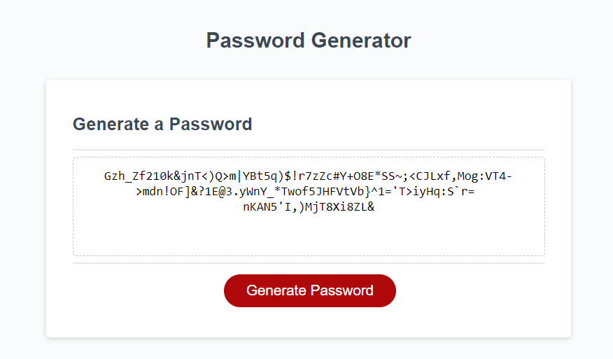

# Create a Password Generator

## Project Task

Create an application that can generate a random password based on criteria of user's input.

## User Story

```
An employee with access to sensitive data wants to use the password generator to generate a random/strong password 
to meet certain criteria for greater security.

```

## Acceptance Criteria

```
The password generator application should meet below requirements:
1. Present a series of prompts for password criteria when user click the button
   to generate a password.
2. Prompt the user to input a number for password length. The length of the password is
   **at least 8** characters and **no more than 128** characters.
3. Confirm whether or not to the user wants to include **lowercase alphabet**.
4. Confirm whether or not to the user wants to include **uppercase alphabet**.
5. Confirm whether or not to the user wants to include **numeric**.
6. Confirm whether or not to the user wants to include **special characters**.
7. Validated the user's answer has at least one character type selected
8. The generated password matches the selected criteria.
9. Displayed the password in an alert or written to the page.
```

## Mock-Up
The following image shows the web application's appearance:




## URL


